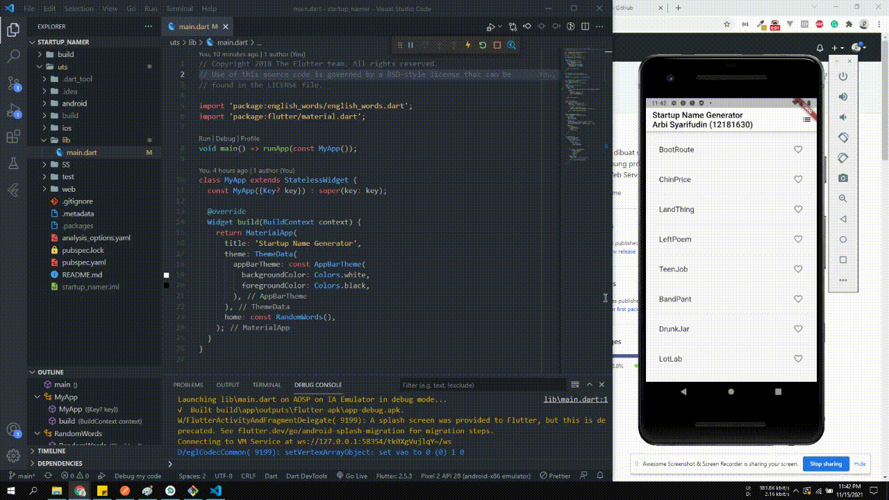
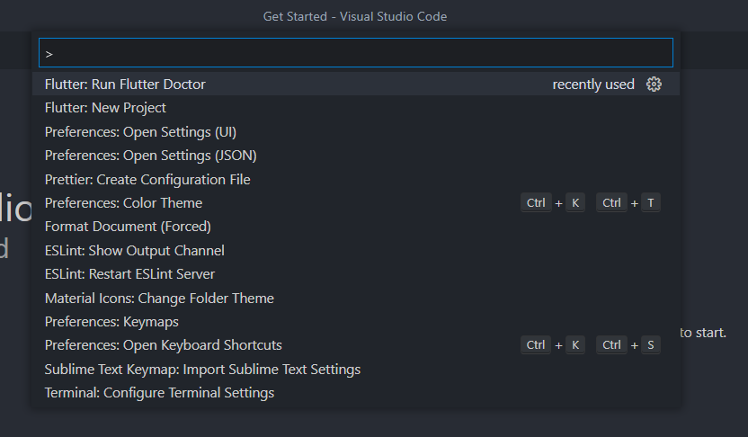

# startup_namer

## Tugas 6 - Mobile Programming
### Oleh: Arbi Syarifudin (12181630)

___

## Hasil :


## Soal dan Ketentuan

1. Mengikuti Panduan Dasar pembuatan Mobile App dengan Flutter melalui tautan berikut: 
   * [Write your first Flutter app, Part 1](https://flutter.dev/docs/get-started/codelab)
   * [Write your first Flutter app, Part 2](https://codelabs.developers.google.com/codelabs/first-flutter-app-pt2)

2. Menjelaskan Materi yang terdapat pada 2 (dua) panduan diatas.

## Penjelasan

### Bagian 1 : [Write your first Flutter app, Part 1](https://flutter.dev/docs/get-started/codelab)

- Disini kita diajarkan untuk memulai membuat aplikasi flutter sederhana bernama 'Startup Name Generator' dengan nama project nya 'startup_namer'
- Aplikasi tersebut berupa aplikasi sederhana yang akan menampilkan daftar nama-nama yang dibuat acak membentuk suatu nama dan frasa baru, dan bisa dipakai sebagai referensi penamaan startup
- Caranya:
   1. Install Android Studio dan Flutter SDK dengan mengikuti panduan yang ada [disini](https://flutter.dev/docs/get-started/install).
   2. Buka **Visual Studio Code** (VS Code), lalu install Ektensi **Dart** dan **Flutter** di **Extension Marketplace**-nya VS Code.
   3. Setelah install berhasil, tekan tombol ```CTRL + SHIFT + P``` pada keyboard yang akan membuka *Command Pallete*
   4. Buka *Command Pallete*, ketik "```Flutter: New Project```", pilih ```Application```, dan cari folder untuk menyimpan project Flutter ini
   
   
   
   1. Pada *Commad Pallete* ketik "```Flutter: Run Flutter Doctor```", lalu klik atau enter untuk menjalankan pengecekan apakah semua persyaratan yang dibutuhkan oleh Flutter sudah terpenuhi. Tandanya adalah akan muncul suatu daftar *tool/library/dsb* yang diperlukan untuk menjalakan Flutter dan mereka akan **tercentang** semua. Jika ada yang bertanda **silang**, silakan install dia terlebih dahulu.
   
    

   1. Buka *Command Pallete* dan ketik "```Flutter: Launch Emulator```", lalu pilih ```Create Emulator```, maka VS Code akan secara otomatis membuatkan kita sebuah emulator Android dan menjalankannya. Proses ini cukup memakan waktu, jadi tunggu saja.
   2.  Setelah selesai maka Emulator akan dijalankan. Setelah emulator terbuka, buka file ```main.dart``` lalu **tekan F5** pada keyboard dan aplikasi Flutter kita akan mulai di *build* dan setelah itu akan dijalankan pada emulator. Hasilnya:
   
    

- Nah, sebenarnya tidak harus menggunakan Emulator, kita juga bisa menggunakan Smartphone yang kita miliki, dengan cara mengaktifkan ```USB Debugging``` pada Smartphone lalu menghubungkannya dengan Laptop kita.
- Lanjut. Pada panduan tersebut, kita juga diajarkan bagaimana cara menginstall package / dependecy, misalnya package ```english_words```. Caranya:
   Buka file ```pubspec.yaml```, lalu pada bagian **dependencies:**, tambahkan 1 baris baru yaitu: \
       ```english_words: ^4.0.0```
   ```
   dependencies:
      flutter:
         sdk: flutter
      cupertino_icons: ^1.0.2
      english_words: ^4.0.0
   ```
- Saat kita melakukan perubahan pada file ```pubspec.yaml```, VS Code akans secara otomatis menjalankan perintah ```flutter pub get``` untuk memasang dependency yang baru kita tambahkan. Namun jika tidak berjalan, cukup jalankan secara manual via terminal.
- Dimateri tersebut juga diajarkan cara membuat fungsi custom bernama ```randomWords()``` untuk generate kata-kata secara acak.
- Diajarkan juga cara buat infinite scrolling ListView untuk menampilkan halaman listView berupa daftar **nama startup** acak yang digenerate secara otomatis tadi

 
### Bagian 2 : [Write your first Flutter app, Part 2](https://codelabs.developers.google.com/codelabs/first-flutter-app-pt2)

- Di bagian 2, kita diajarkan cara menambah icon hati pada list **nama startup** yang sudah kita buat sebelumnya, bisa love dan unlove untuk menyimpan nama yang kita minati ke **daftar tersimpan**

 
- Diajarkan tentang cara **mengganti tema warna**, serta diajarkan juga **Navigation & Route** agar kita bisa pindah ke halaman lainnya, dalam hal ini halaman **daftar tersimpan**, seperti pada gambar:

 
- Selesai

